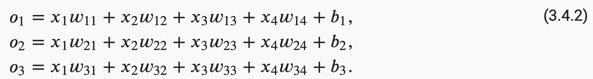
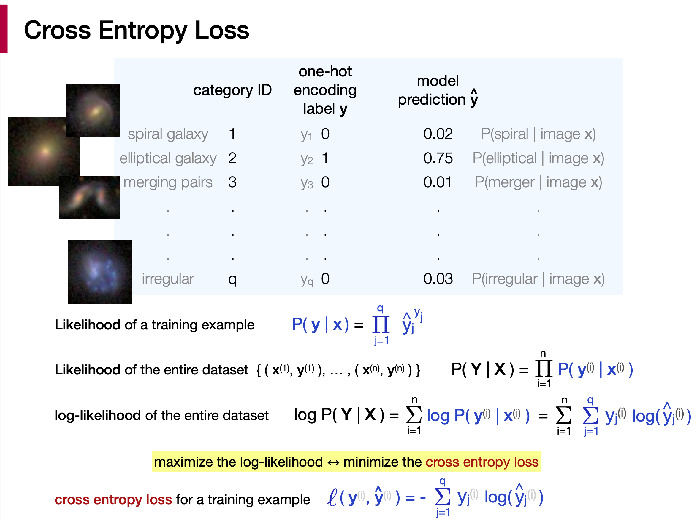
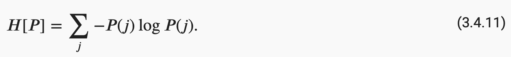

# 3.4 Softmax Regression

## 1. Classification Problem

**Ways to represent categorical or discrete target variable  y**  

- Label encoding  
  e.g. size prediction : small, medium, large  
  y ∈ {1, 2, 3}

- **One-hot encoding**   
  e.g. y ∈ {(1,0,0), (0,1,0), (0,0,1)}  
    Useful expression when there's no natural ordering on the categorical target variables. 

  e.g. Hand-written digits : 0, 1, 2, 3, 4, 5, 6, 7, 8, 9  

## 2. Network Architecture

How many parameters are there in this network structure?

**w** matrix : 4x3 parameters  
**b** bias   : 3 parameters (for 3 neurons in the output layer)

**logits** : $o_1$, $o_2$, $o_3$ (linear weighted sum of the inputs $x_{1-4}$ )

## 3. Parameterization Cost of Fully-Connected Layers (Optional)

- [Beyond Fully-Connected Layers with Quaternions: Parameterization of Hypercomplex Multiplications with 1/n Parameters](https://arxiv.org/abs/2102.08597) (Zhang et al. 2021) 

## 4. Softmax Operation

- **Softmax converts logits into probabilities.** 

- Recall : Logistic Regression with 2 class labels (y=0 or 1).  

- Softmax function is an extension of the sigmoid function to the multiclass classification problem (see details in [this blog post](https://stats.stackexchange.com/questions/233658/softmax-vs-sigmoid-function-in-logistic-classifier).). 

- **Affine Transformation** : A linear transformation of an input. 

- **Why is logistic regression considered a linear model, althought softmax is a nonlinear function?**  
  Logistic regression is considered a generalized linear model because the outcome always depends on the sum of the inputs and parameters. In other words, the output cannot depend on the product (or quotient, etc.) of its parameters. ([reference](https://sebastianraschka.com/faq/docs/logistic_regression_linear.html))

## 5. Vectorization for Minibatches

&emsp; n : number of training examples per batch  
&emsp; d : dimension of input vector   
&emsp; q : dimension of output vector   

## 6. Cross Entropy Loss Function for Softmax Regression

  

&emsp;  * Let pow(0,0)=1 for likelihood of a training example. ([Wiki: Zero to the power of zero](https://en.wikipedia.org/wiki/Zero_to_the_power_of_zero))  

## 7. Information Theory Basics (Optional)

**Entropy : measures how unpredictible a probability distribution is.**   
  
e.g. For a galaxy classification task with 3 different class labels for **Elliptical**, **Spiral**, and **Irregular** galaxies:  

- A 100% certain elliptical galaxy, it's one-hot label would be **y_clear** = [1, 0, 0]  
  Entropy(**y_clear**) = 0 

- For a very vague galaxy image, it's one-hot label **y_vague** could be [0.33, 0.33, 0.33]  
  Entropy(**y_vague**) = log(3)  &emsp;   <- high entropy, the image is so vague such that we can't get any information about its morphology.

**Cross-Entropy = entropy + KL divergence**  
&emsp;  **H(P, Q) = H(P) + D_KL( P || Q )**  
&emsp;  Let P = **y** (true label) &ensp; and &ensp; Q = **ŷ** (predicted label).  
&emsp; If H(**y**) = 0, &emsp; (assume each image can only be classified into 1 catagory with 100% probability)  
&emsp; We have : **H(y, ŷ) = D_KL( y || ŷ )**  
&emsp; i.e. → Minimizing the cross-entropy loss is equivalent to minimizing the KL divergence 

 &emsp;  * The one-hot vector **y** can be viewed as a (discrete) probability distribution ( ∵ Σ y_j = 1  &emsp; j=1, 2, ... q for each catagory ID ).

 &emsp;  * Nice blog post on entropy, cross entropy and KL divergence in this [link](https://towardsdatascience.com/entropy-cross-entropy-and-kl-divergence-explained-b09cdae917a).

## 9. Summary

### Cross-entropy minimization

 - Maximizing the likelihood with respect to the modeling parameters is the same as minimizing the cross-entropy loss.

- Information theory point of view : Minimizing the cross-entropy loss is equivalent to minimizing the KL divergence between the true target distribution (**y**) and the predicted class distribution (**ŷ**).
  
 