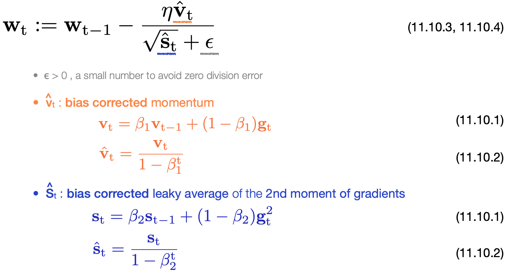
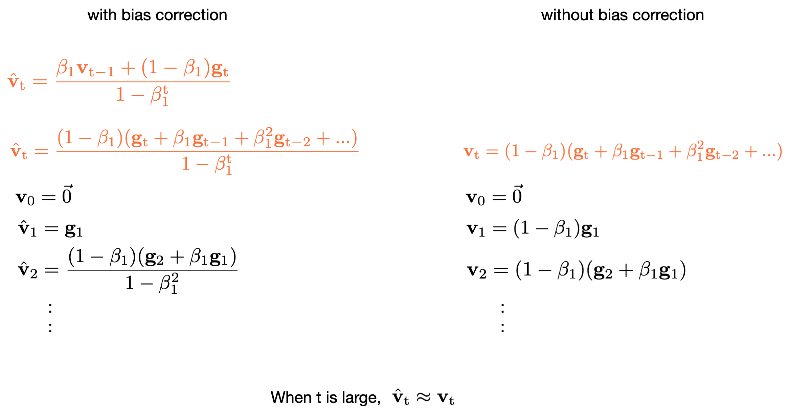

# [11.10 Adam](https://d2l.ai/chapter_optimization/adam.html)

- **Adam** is a rather popular optimization algorithm used in deep learning. It's basically a combination of **momentum** and **RMSprop** into one efficient learning algorithm. 

### Adam algorithm

&emsp;&emsp;&emsp;&emsp; 

- Common choices are β1 = 0.9, and β2 = 0.999. -> The momentum **v**t term adapts more quickly to local changes, whereas the state vector **s**t changes more smoothly with larger window averaging over past steps. 

- The explicit learning rate η provides extra freedom to adjust the step length during training.

- Nice properties of Adam : the numerator has the **momentum** term to accelerate the learning process, and the denominator uses the **state vector**, the squared gradient information accumulated over a window of time,  to even out the progress made in each dimension. 

#### Bias correction

&emsp;&emsp;&emsp;&emsp; 

- The main reason to include these bias correction terms is to remove the effect of initialization at **v**0=**0** and **s**0=**0** near the early phase of iterations.
- When *t* is large, the bias correction factor is small. 

- [Implementation in Pytorch](https://pytorch.org/docs/stable/generated/torch.optim.Adam.html) : ``torch.optim.Adam(params, lr=0.001, betas=(0.9, 0.999))``. 

### Reference

- Adam: A Method for Stochastic Optimization -- Kingma & Ba 2014 ([arxiv:1412.6980](https://arxiv.org/abs/1412.6980))

- Adaptive Methods for Nonconvex Optimization -- Zaheer et al. 2018 ([NIPS2018](https://papers.nips.cc/paper/2018/file/90365351ccc7437a1309dc64e4db32a3-Paper.pdf))