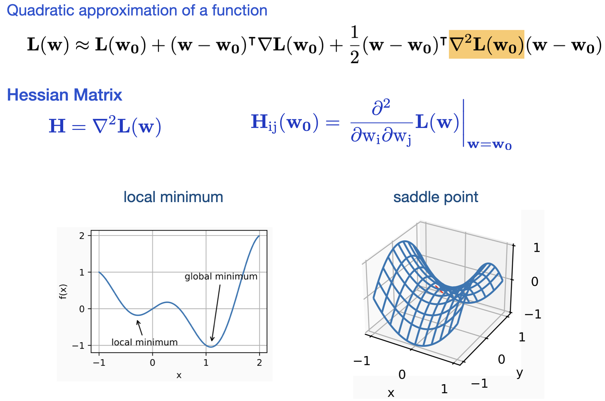

# [11.1 Optimization and Deep Learning](http://d2l.ai/chapter_optimization/optimization-intro.html)

- In optimization, a **loss function** is often referred to as the **objective function** of the optimization problem.

#### The goals of Optimization and Deep Learning

- The goals of optimization and deep learning are fundamentally different.
  - Optimization : minimizing an (training) objective function.  
  - Deep Learning : finding a model with low generalization error, given a finite amount of data.  
  
  When training a network with an optimization algorithm, the goal of optimization is simply to **reduce the training error**. In statistical inference / machine learning we care about finding an optimal model that generalizes well on unseen data. So the true goal is to **minimize the generalization error**.  
  
#### Empirical Risk v.s. True Risk

- Empirical Risk / Empirical Error : An average loss over the training data to approximate the risk.
- True Risk / Generalization Error : The expectation of the loss over the entire population of data drawn from their true distribution.
- In practice we don't know the true risk because we can't obtain the entire population of data. But we have i.i.d. data sampled from the underlying data distribution. Based on central limit theorem, we expect empirical risk -> true risk when the training dataset is large.

### Optimization Challenges in Deep Learning

### 1) Vanishing Gradients 

- Vanishing gradients can cause optimization to stall. 

### 2) Local Minimums & Saddle Points

- Critical Points : points where gradient = 0 .  
  Critical points can be further classified into 3 catagories : 
  - Local Minimum : **H**(**w_0**) is positive definite (all eigenvalues > 0).
  - Local Maximum : **H**(**w_0**) is negative definite (all eigenvalues < 0).
  - Saddle Point  : when the Hessian has both positive and negative eigenvalues

- In high-dimensional parameter spaces, critical points are more likely to be saddle points rather than local minima.   
  The probability of 'getting stuck' in a local minimum is very small.  
  Probability = 1/2^n, with `n` being the total number of parameters.  
  For a deep network with millions of parameters, it is almost unlikely to have all the 2nd derivatives being positive in all the directions.

## Reference

- [Escaping from Saddle Points](http://www.offconvex.org/2016/03/22/saddlepoints/)