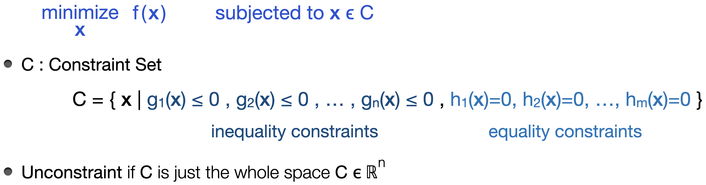
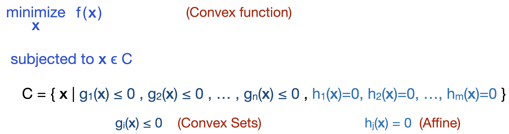
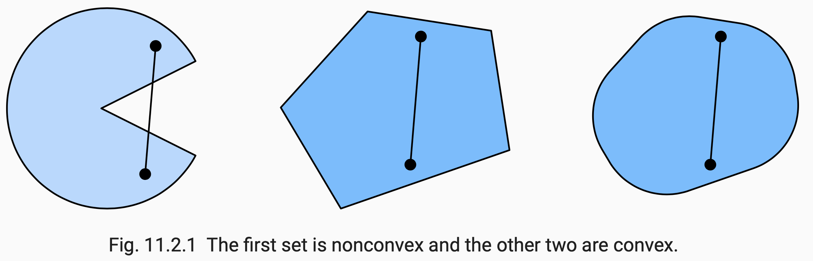
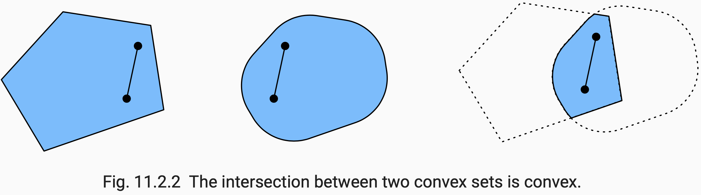
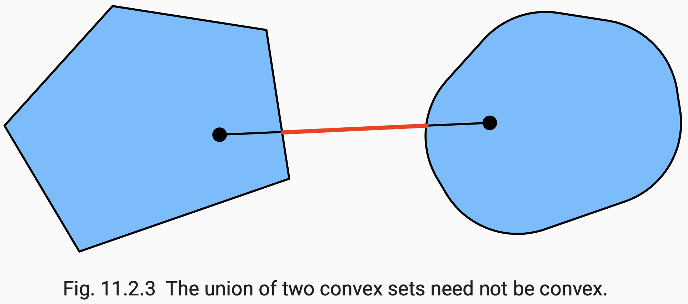
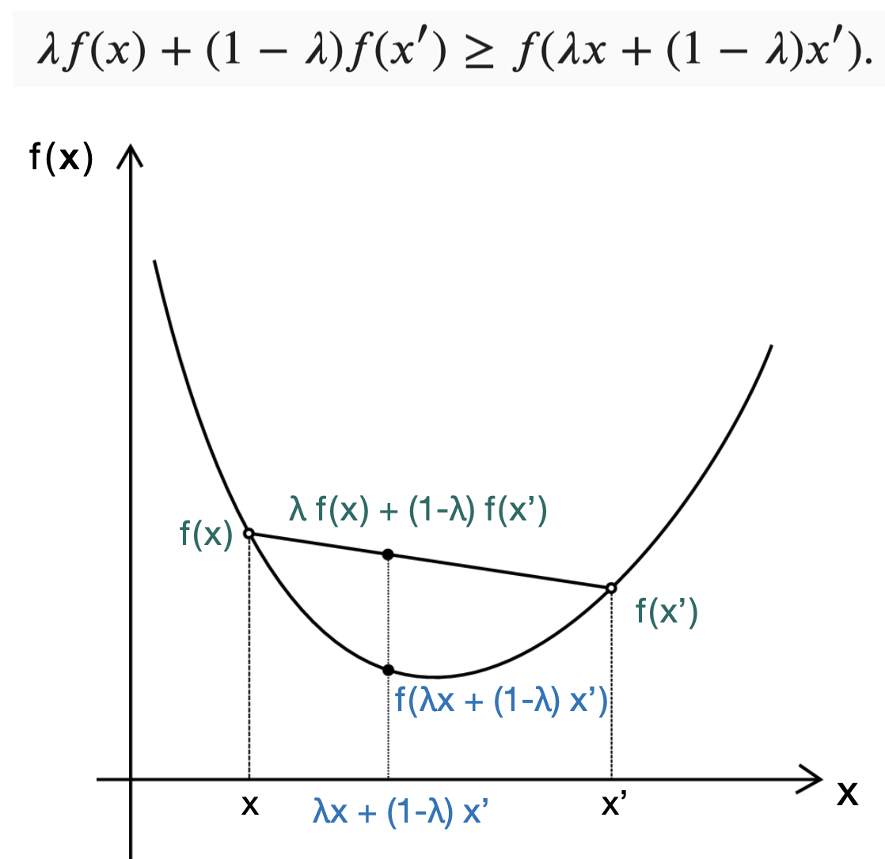
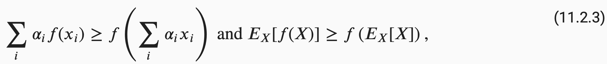
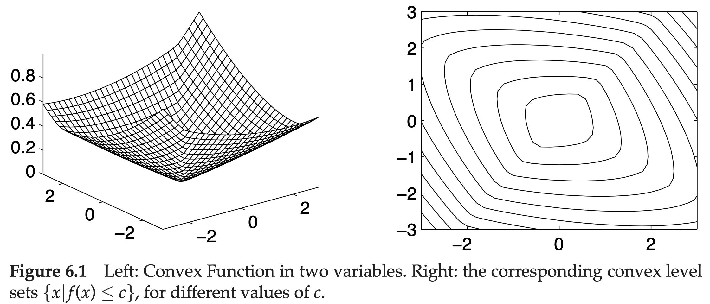

# [11.2 Convexity](http://d2l.ai/chapter_optimization/convexity.html)

- In deep learning, the optimization problems we are dealing with are generally **nonconvex**. However, the analysis of convex problems can provide useful insight into how to approach optimization. 

### Optimization Problem

&emsp; &emsp; 

### Convex Optimization Problem

&emsp; &emsp; 

- An optimization problem is convex if the objective function is a **convex function**, the inequality constraints are **convex sets** and the equality constraints are **affine**.

### Definitions

#### &emsp; Convex Set

&emsp; &emsp; &emsp; 

- For any *a*, *b* ϵ *C*, if all the points on the line segment connecting *a* and *b* are all within set *C*, then we say set *C* is a convex vector space.

&emsp; &emsp; &emsp; 

- If *X* and *Y* are convex sets, then *X* ∩ *Y* is also convex. 
  
&emsp; &emsp; &emsp; 

- Unions of convex sets need not be convex.

#### &emsp; Convex Function

&emsp; &emsp; &emsp; 

- **Jensen's Inequality**  
  The expectation of a convex function is no less than the convex function of an expectation.
&emsp; &emsp; &emsp;   
    (Here α_i ≥ 0 and Σ_i α_i = 1.)

#### &emsp; Affine

- A function *A* is affine if there is a linear function *L* and a vector **b** such that  
  *A*(**x**) = *L*(**x**) + **b** &emsp; &emsp;&emsp; for all **x**.  
  Basically, an **affine function** is just a **linear function** plus a **translation**.

 &emsp;  * [Reference : Linear and Affine Functions](https://math.libretexts.org/Bookshelves/Calculus/The_Calculus_of_Functions_of_Several_Variables_(Sloughter)/01%3A_Geometry_of_R/1.05%3A_Linear_and_Affine_Functions).

### Nice Properties of Convex Functions

- The local minima of convex functions are also the global minima. 

- Any below set of a convex function is a convex set.
  - Below Set : the vector space of **x** for which f(**x**) ≤ c.  
  &emsp; &emsp; &emsp; 

  &emsp;  * Image Credit : http://agbs.kyb.tuebingen.mpg.de/lwk/ 

- A twice-differentiable function is **convex** if and only if its **Hessian** (a matrix of second derivatives) is **positive semidefinite**.

### Convex Optimization with Constraints

- In general, solving a constrained optimization problem is difficult. But we can re-write the problem in the equivalent **Lagrangian form** to make the optimization process simplier to deal with. 

- To do so, we add the constraint conditions ( g_i(**x**)≤0 ) to the objective function as the penalty terms ( λ_i g_i(**x**) ).
 
- In [§4.5](./4.5_weight-decay.md), we've used this trick when introducing the L1 & L2 regularization methods. 
  - We add the **L1 norm** ( λ/2 |**w**|_1 ) or the **L2 norm** ( λ/2 ||**w**||_2 ) of the network weight parameters to the raw cost function, and hoping that we can find a workable model subjected to smaller weights.   
  - From the constrained optimization point of view we can see that this will ensure that  
|**w**|_1 &ensp; < r  &emsp; &emsp; &emsp; &emsp; &emsp;  (for L1 regularization), and  
||**w**||_2 < r**2  &emsp; &emsp; &emsp; &emsp; (for L2 regularization)   
for some r (see the cyan region in the figure below)  
  - Adjusting the value of regularization parameter λ affects the constrained region of the problem (larger λ corresponds to smaller r). 

