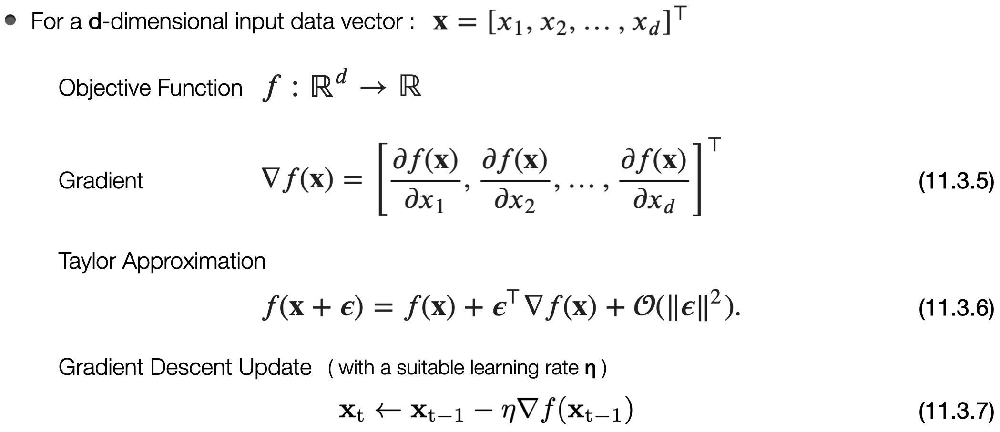
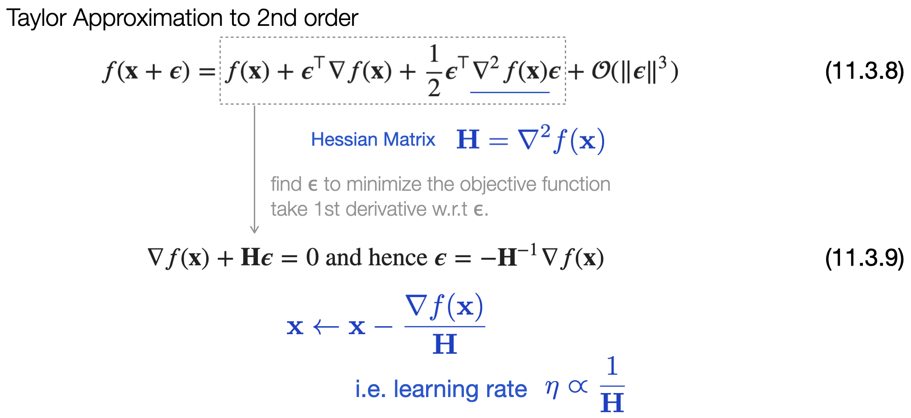

# [11.3 Gradient Descent](https://d2l.ai/chapter_optimization/gd.html)
### 1. Intuition behind gradient descent 

**One-Dimensional Gradient Descent**

- **To first order**, f(x+ϵ) can be approximated by the function value f(x) and the 1st derivative f'(x) at x.   
  

- Let ϵ = - η f'(x) for some small η > 0. Plug in Eq.(11.3.1), we have     

  If we use   &emsp; &emsp; x ← x - η f'(x) &emsp; &emsp; &emsp; &emsp; &emsp;&emsp;&emsp;&emsp;&emsp;&emsp;&emsp;&emsp;&emsp;&emsp;&emsp;&emsp; (11.3.4)   to iterate x, the value of function f(x) might decline :   &emsp;&emsp; f( x-η f'(x) ) ≈ f(x) - η [f'(x)]**2 ⪅ f(x) &emsp;&emsp;&emsp; ( ∵ η [f'(x)]**2 ≥ 0 ) .

**Multivariate Gradient Descent** 

&emsp; 

### 2. The choice of Learning Rate

- Learning rate matters.  
 

- Adjusting the learning rate could be complicated, espicially in high dimensional space. 

#### Newton's Method

- How to pick a suitable learning rate? Consider information from the **second-order derivative** (**curvature**) of the objective function f.   
  &emsp;&emsp;&emsp;&emsp;&emsp;&emsp;&emsp;&emsp;&emsp;&emsp;&emsp;&emsp;&emsp;&ensp; ∇f(**x**) is smooth → can use larger learning rate.   change of gradient function ∇f(**x**) is large → use smaller learning rate.

&emsp;&emsp; 

- For a deep learning network with millions of parameters, computing a Hessian matrix is too expensive O(*d*x*d*), with *d* being the number of parameters. 

#### Preconditioning

- Instead of computing the full Hessian matrix, one alternative approximation would be only computing its diagonal entries, and with the updating algorithm being :   
  

- Preconditioning with gradient descent has similar effect as selecting a different learning rate for each parameter dimension.
