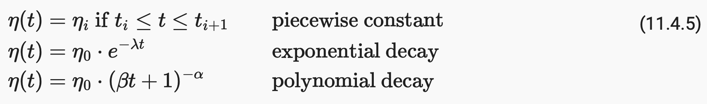

# [11.4 Stochastic Gradient Descent](https://d2l.ai/chapter_optimization/sgd.html) &emsp; &   [11.5 Minibatch Stochastic Gradient Descent](https://d2l.ai/chapter_optimization/minibatch-sgd.html)

## Overview : Variants of Gradient Descent

- Depending on the **update frequency** of model parameters, there are 3 types of gradient descent variants : **Full-Batch**, **Stochastic**, and **Mini-Batch** Gradient Descents.  
  &emsp; 

## Full-Batch Gradient Descent

- In full-batch gradient descent, all the training examples are taken into account to make a single update of the model parameters.

- The update trajectory is rather **smooth** because the moving direction of every single step is the mean gradient of the entire training examples. 

- Without parallelization, the computational cost for each independent parameter update iteration is O(*n*), with *n* being the total number of training example. 

- Full-batch gradient descent is not particularly data efficient whenever data is very similar.

## Stochastic Gradient Descent

- In stochastic gradient descent, the model parameters are updated with just one example at a time. 

- Stochastic gradient descent is not particularly computationally efficient since CPUs and GPUs cannot exploit the full power of vectorization.

- Stochastic gradient is an unbiased estimate of the full-batch gradient.  
  &emsp;&emsp;&emsp;&emsp; 

- The trajectory of parameters fluctuate over the training examples, due to the stochastic nature of the gradient. 

- The noisy learning process could make it hard for the algorithm to settle down on a good solution / critical point, if the learning rate parameter η is not properly adjusted. 

#### Dynamic Learning Rate

- A time-dependent learning rate η(*t*) adds flexibility in controlling the convergence of an optimization algorithm. If η decays too quick, we are not making progress in optimization ; if η decays too slowly, we may end up wasting too much time letting the model jump around. 

- Few basic strategies of η(*t*) :  
  &emsp;&emsp;&emsp;&emsp; 

## Mini-Batch Gradient Descents

- In mini-batch gradient descent, we **randomly split** the training examples into small batches, and use each mini-batch to estimate the update direction of model parameters. 

- Mini-batch gradient descent seeks a balance between the robustness and the noisy features of the full-batch and stochastic gradient descents, with the benefit of utilizing vectorized implementation for faster computations.

- Batch-size is a hyperparameter you can tune in the training algorithm. It's usually set to be a power of 2 that fits the memory requirements of the GPU or CPU like 32, 64, 128, 256.

- Smaller batch-size makes the training more **data efficient** at the cost of **bringing larger stochastic**.   Larger batch-size results in a more **stable learning process**. 

- Smaller batch-size typically has **better generalization performance**. The **noisy oscillation feature** makes the optimization algorithm more likely to settle down on a wide and flat plateau, rather than on a narrow canyon.   
&emsp;&emsp;&emsp;&emsp; 