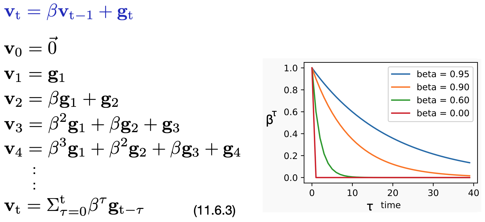

# [11.6 Momentum](https://d2l.ai/chapter_optimization/momentum.html)

- In mini-batch gradient descent, we compute the **mean gradient** of *training examples within each mini-batch* as the negative direction to update our network parameters at each time-step iteration.  
  &emsp;&emsp;&emsp;&emsp; 

### Mini-Batch stochastic gradient descent with Momentum

- Instead of using only the gradient of the current step to determine the direction to go, we can replace **g**t with **v**t to better optimize the parameter searching process.  
Here **v**t is called **momentum**.  
&emsp;&emsp;&emsp;&emsp; 

#### Momentum ( **v** ) : a leaky average over past gradients

- Momentum accumulates the **gradients of the past and current steps** to determine the direction to go next.  
  
  &emsp;&emsp;&emsp;&emsp; 

- When β = 0, we recover the regular gradient descent.

- With **smaller β**, we only have a slight correction w.r.t. the regular gradient method. The learning curve adopts more quickly to the current change. 
  
- With **higher β**, we have more contributions coming from the past steps. The learning curve would be smoother due to averaging over a larger window of the past gradient history.  

- β controls the amount of history (momentum) to include in the update. We are approximately **averaging over the last 1/(1-β) gradients**, due to exponentiated downweighting of past data.

- Most of the time, stochastic gradient descent with momentum works better and faster than regular stochastic gradient descent.

- [Implementation in Pytorch](https://pytorch.org/docs/stable/generated/torch.optim.SGD.html) : ``torch.optim.SGD(params, lr, momentum)``.  