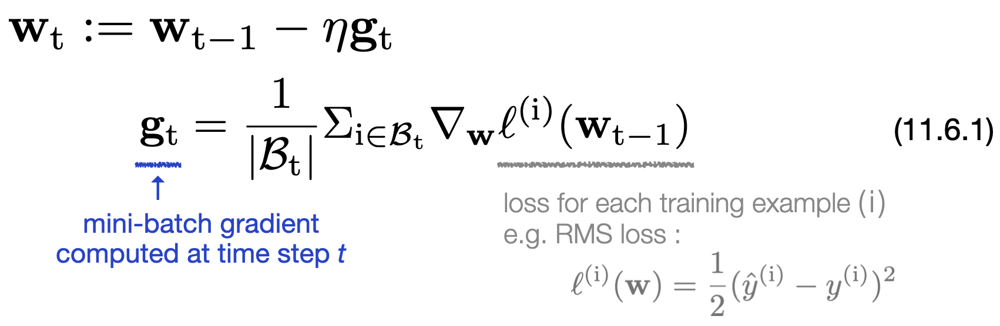
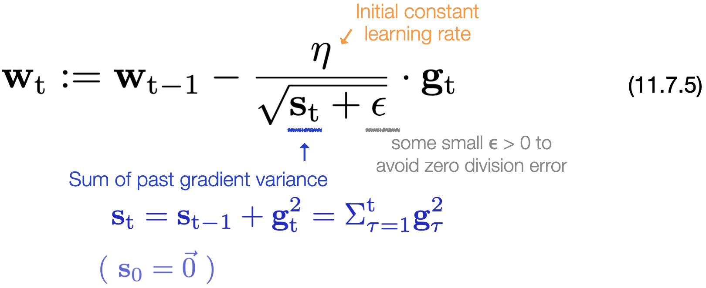

# [11.7 Adagrad](https://d2l.ai/chapter_optimization/adagrad.html)

- For the most basic mini-batch gradient descent, the learning rate η is simply a constant value.  
  &emsp;&emsp;&emsp;&emsp; 

- **Adagrad**, which stands for **Adaptive Gradient Optimizer**, allows the effective learning rate to vary differently w.r.t. each individual parameter, iteration, and feature sparsity. 

### Adagrad algorithm
  &emsp;&emsp;&emsp;&emsp;   
  &emsp;&emsp;&emsp;&emsp; Note that the operations are applied **coordinate / parameter wise**. 

- Adagrad adaptively adjusts the learning rate according to **the sum of the squares of the previous gradient steps**. 

- For every iteration, the effective learning rate **decreases** dynamically on a per-coordinate basis, since the sum of the squared past gradients value increases along with iterations. So the effective learning rate gradually become small.  

- **Adagrad is particularly effective for sparse features** where the learning rate needs to decrease more slowly for infrequently occurring terms.

- [Implementation in Pytorch](https://pytorch.org/docs/stable/generated/torch.optim.Adagrad.html) : ``torch.optim.Adagrad(params, lr)``. 
