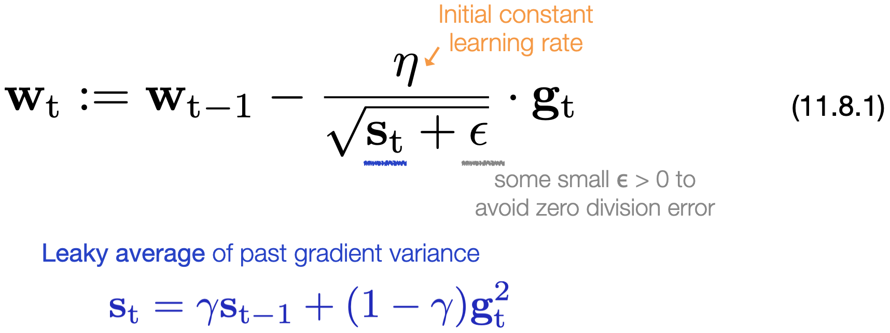
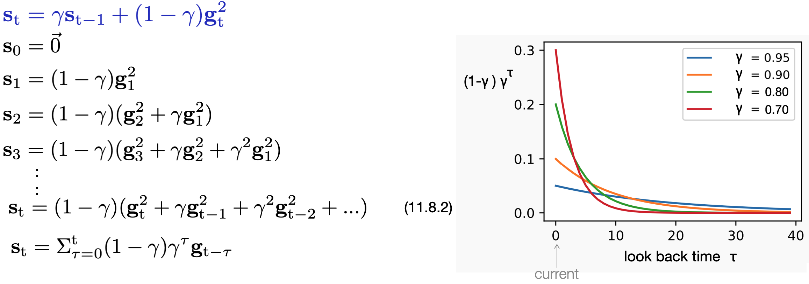

# [11.8 RMSProp](https://d2l.ai/chapter_optimization/rmsprop.html)

- **RMSProp** is very similar to **Adagrad**. Both algorithms use the **square of the gradient** histories to scale the initial learning rate coefficients.

- **Adagrad** accumulates **all** the past squared gradient in the state vector **S**t ([§11.7](./d2l_briefs/11.7_adagrad.md) eq. 11.7.5), which leads to a continuous growing **S**t. In such design, the overall learning speed is guaranteed to decrease over time. This property may not be ideal when dealing with a non-convex optimization problem. 

- Rather than considering the entire gradient history, **RMSProp** put more weights on recent gradients. 
  
- **RMSProp** adopts the **leaky average** when updating the state vector **S**t, and introduces a hyperparameter **γ** to adjust the overall influences from past time steps. 
  
### RMSProp algorithm

&emsp;&emsp;&emsp;   

#### State vector (St) : a leaky average over past gradient variance

&emsp;&emsp;&emsp;   

- **S**t accumulates the **squared gradient** of the current and past steps (with decaying weights) to adjust **the effective learning rate** on a **per-coordinate** basis. 

- The leaky average computation here is similar to that of **momentum** ([§11.6](./d2l_briefs/11.6_momentum.md)), yet with an extra normalization term (1-γ) in the front, in order to make **each time step's contribution** roughly **summed up to 1** (&ensp;i.e.  (1-γ) (1 + γ + γ^2 + r^3 + ... ) ≈ 1 &ensp;).

- The coefficient γ controls how long the history is effective when adjusting the per-coordinate scale. The larger γ, the more past steps are effective in affecting the learning rate adjustment. 

- [Implementation in Pytorch](https://pytorch.org/docs/stable/generated/torch.optim.RMSprop.html) : ``torch.optim.RMSprop(params, lr, alpha)``. 

