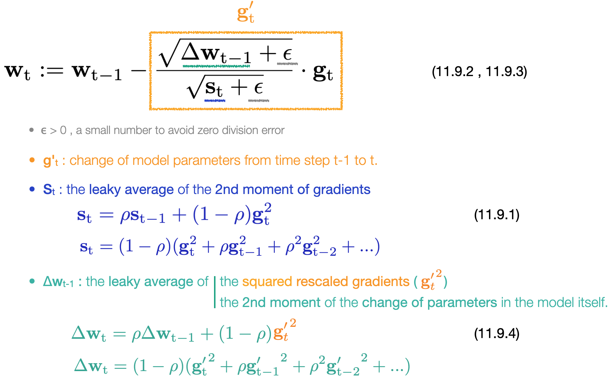

# [11.9 Adadelta](https://d2l.ai/chapter_optimization/adadelta.html)

### Adadelta algorithm

&emsp;&emsp;&emsp;&emsp; 

- **Adadelta** has no (initial) learning rate parameter. Instead, it uses **the rate of change in the parameters** itself to adapt the learning rate (c.p. to eq.11.8.1 of [§11.8 RMSProp](./d2l_briefs/11.8_rmsprop.md)).

- Adadelta uses **leaky averages** to keep a running estimate of the **state statistics**, with the hyperparameter **ρ** controling the relative contributions from the **history of past steps**, for each update iteration. 

- The state variable **s**t is used to store the weighted history of **the 2nd moment of gradients**.   And Δ**w**t is used to store weighted history of **the 2nd moment in the change of parameters**.

- [Implementation in Pytorch](https://pytorch.org/docs/stable/generated/torch.optim.Adadelta.html) : ``torch.optim.Adadelta(params, lr=1.0, rho=0.9)``. 
  - Note that here pytorch allows you to further adjust learning rate η to scale the updating step in eq.11.9.2, **w**t = **w**t-1 - η**g**'t. The default learning rate parameter is set to be 1.

### Reference

- ADADELTA: AN ADAPTIVE LEARNING RATE METHOD -- Zeiler 2012 ([arxiv:1212.5701](https://arxiv.org/abs/1212.5701))
