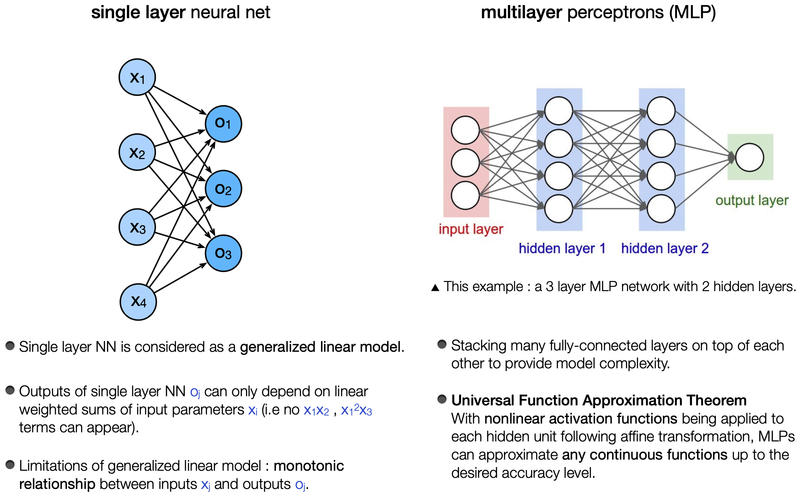
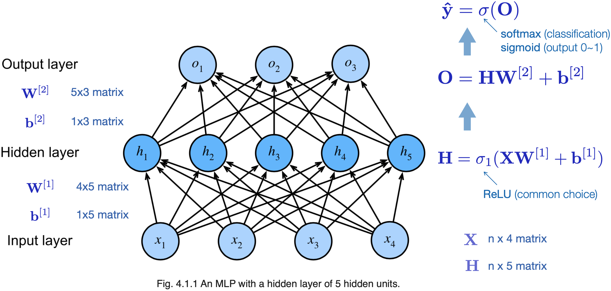

# [4.1 Multilayer Perceptrons](https://d2l.ai/chapter_multilayer-perceptrons/mlp.html)

## 1. Hidden Layers

\* [Visual proof of Universal Function Approximation Theorem](http://neuralnetworksanddeeplearning.com/chap4.html)

### Matrix representation for two layer (single hidden layer) MLP

## 2. Activation Functions

- Why do we need non-linear activation functions? (see §4.1.1.3)  
    Without non-linear activation functions, no matter how many layers are there in the neural network, the output is just a linear combination of teh input features (i.e. standard linear regression result). 
    

### ReLU (rectified linear unit)

- ReLU(x) = max(0, x)

- Usually the default choice of activation function.
  
- Slope = 1 when x > 0; slope = 0 when x < 0. 
  Technically the derivative at x = 0 is not well define. But there’s only a small chance that x will be exactly 0. So in practice, just pretend the derivative at x = 0 being 0 or 1.  

- Advantage : The derivative of the activation function is very different from 0 for half space of x. This makes optimization better behaved and alleviates the vanishing gradient problem.

### pReLU (parameterized ReLU)

- pReLU(x) = max(0, x) + α min(0, x)

- Allows information still to pass through, even when x < 0 .

### Sigmoid 

- Sigmoid transforms the inputs in the range (-inf, inf) to values in the range (0, 1). 
  
- When the input is close to 0, the sigmoid function approaches a linear transformation.
  
- The derivative of sigmoid function become very small when x is very large or very small. This slows down the gradient decent process. 

### Tanh

- Tanh transforms the inputs in the range (-inf, inf) to values in the range (-1, 1). 

- Point symmetry at the origin of the coordinate system.