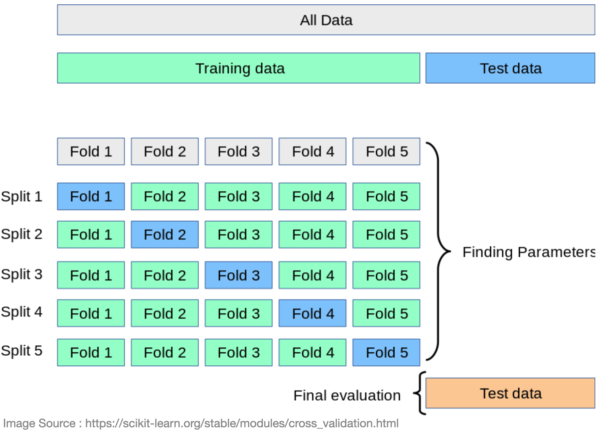
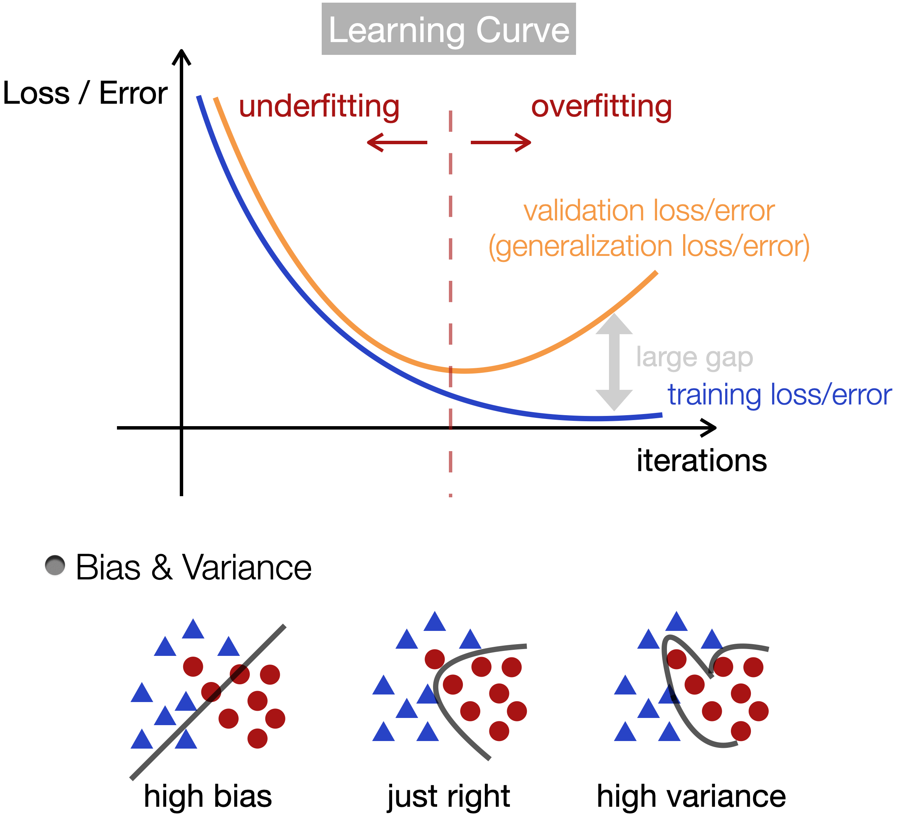

# [4.4 Model Selection, Underfitting & Overfitting](https://d2l.ai/chapter_multilayer-perceptrons/underfit-overfit.html)

## 1. Training Error & Generalized Error

- **Training Error**  
    Training error is the error of our model as calculated on the training dataset

- **Generalization Error** 
    - Generalization error is the expectation of our model’s error when we to apply it to an infinite stream of data examples drawn from the same underlying data distribution as our original sample.
    - We can never calculate the generalization error exactly.
    - In practice, we estimate the generalization error by applying our model on validation dataset. 

- **[Glivenko–Cantelli theorem](https://en.wikipedia.org/wiki/Glivenko–Cantelli_theorem)** (foundations of statistical learning theory)
    - Assuming that both training data and the validation data are drawn independently from identical distributions (i.i.d), training error converges to the generalization error when we have more data. 

### Model Complexity

More complex models tend to have the folling properties:

- More trainable parameters (i.e. larger degrees of freedom).
  
- Wider range of values allowed for its trainable parameters.  
  (A model whose parameters can take a wider range of values might be more complex.)
    - Often, we think of a model that takes more training iterations as more complex (model paramters have change to evolve away from zeros).

## 2. Model Selection

- Model Selection : 
  - Hyper-parameters of model : network structure (# of layers, # of hidden units per layer), learning rate, activation functions ...
  - Network parameters : **W** & **b**

### 2.1 Training / Validation / Test datasets

- In the process of developing a ML model, we split our entire data into three distinct datasets (Training, Validation & Test sets), in order to **estimate the performance of our model and understand how good it will generalize to new data**. 

- **Training Set** : The actual dataset that we use to train the model to determine the network parameters (weights and biases). 

- **Validation Set** : Validation set is used to validate our model performance during training. It provides information on the generalizability of our model to unseen data, and is helpful to prevent overfitting. 
  
- **Test Set** : The goal of the test set is to provide an unbiased estimate on the performance of your final network.
  - Final network : the best model selected after iterations of trainings (on training set) and evaluations (on validation set).

### 2.2 K-Fold Cross-Validation

When training data is scarce, we might not even be able to afford to hold out enough data to constitute a proper validation set.

- Split the original data into K non-overlapping subsets.
- Model training and validation are executed K times, each time training on K-1 subsets and validating on a different subset. 
- The training and validation errors are estimated by averaging over the results from the K experiments.

## 3. Underfitting or Overfitting

#### Underfitting
- High training and validation errors (compared with [Bayes error](https://en.wikipedia.org/wiki/Bayes_error_rate) -- the lowest possible error rate).
- The generalization gap between the training and validation errors is small.
- Models in the underfitting regime has **high bias** (i.e. not be able to fit data well).
- How to deal with underfitting?
  - Increase model complexity (e.g. more hidden layers, number of units per layer)
  - Train longer
  - Apply better optimization algorithms
  - Try different network architectures

#### Overfitting
- Training error is significantly lower than the validation error (large generalization gap). 
- Models in the overfitting regime has **high variance** (i.e. performs specifically well under certain noise realization of data).
- How to deal with overfitting?
  - Add more data 
  - Data augmentation
  - Apply regularization techniques (dropout, weight decay, early stopping ...)
  - Try different network architectures