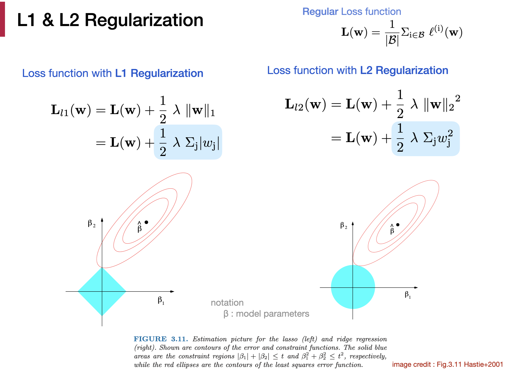

# [4.5 Weight Decay]((https://d2l.ai/chapter_multilayer-perceptrons/weight-decay.html)) (L2 Regularization)

- Limiting the number of features is a popular technique to mitigate overfitting. However, simply tossing aside features can be too blunt an instrument for the job.

## 1. Norms and Weight Decay

### Norms ([§2.3.10](https://d2l.ai/chapter_preliminaries/linear-algebra.html#subsec-lin-algebra-norms))

#### L1 Norm

Sum of the absolute values of a vector **x**'s elements.
                                                         

#### L2 Norm

Square root of the sum of the squares of a vector **x**'s elements.

L2 Norm of a matrix **X** : square root of the sum of the squares of the matrix elements. (This is also called **Frobenius norm** in linear algebra).

### L2 Regularization (Weight Decay)

- Regularization parameter λ. Use a validation set to find the optimal value of λ.
- (1-ηλ) < 1 → The weights of the networ gets smaller over training iterations.
- λ ↗ , **w** ↘ . L2 regularization encourages models with small weights. 
- With the allowed range of network weights constraining to be small, the overall complexity of model decreases. 

## 2. L1 Regularization (Optional)

- L1 tends to shrink coefficients to zero whereas L2 tends to shrink coefficients evenly.
- L1 is therefore useful for feature selection, as we can drop any variables associated with coefficients that go to zero.  
  In other words, L1 encourages a sparse model (model with a small fraction of parameters being non-zero).
  

- Reference : [3 The difference between L1 and L2 regularization](https://explained.ai/regularization/L1vsL2.html)