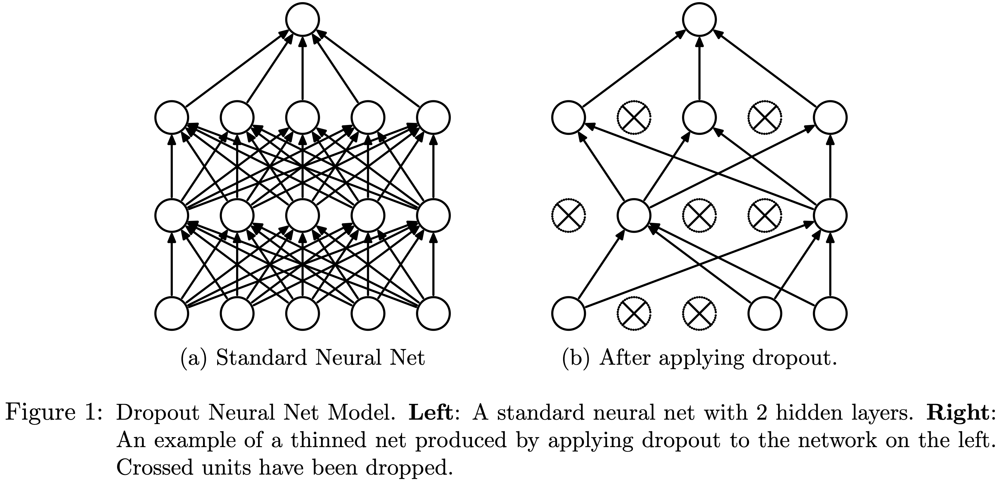
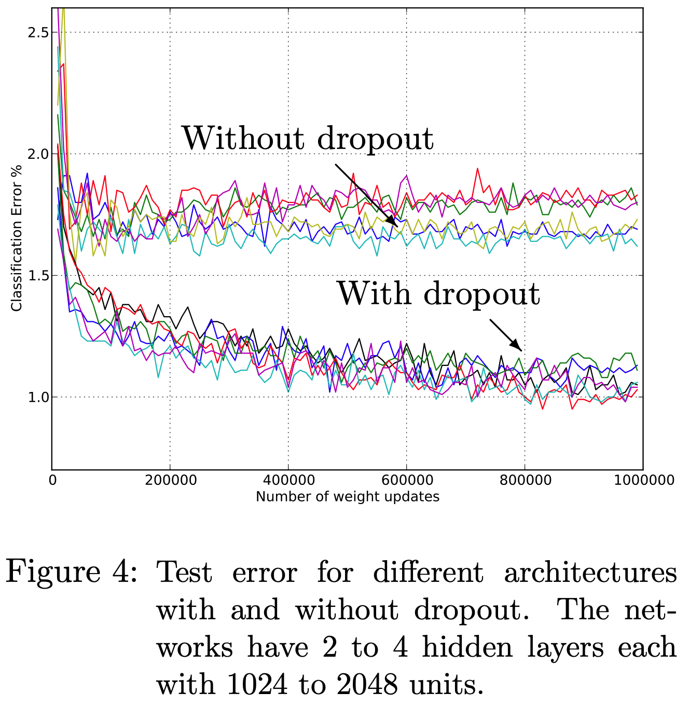
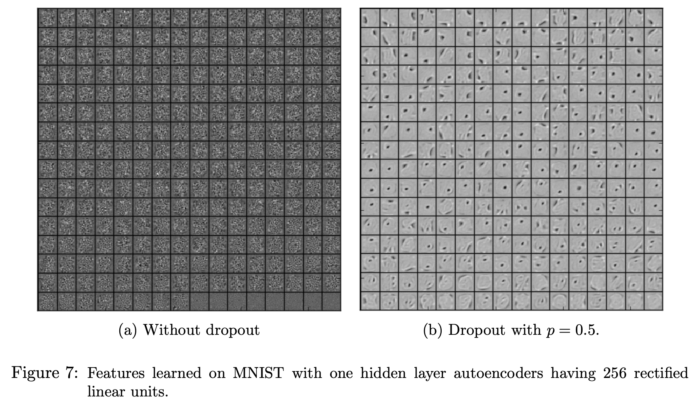

# [4.6 Dropout](https://d2l.ai/chapter_multilayer-perceptrons/dropout.html#)

[Dropout: A Simple Way to Prevent Neural Networks from Overfitting -- Srivastava et al. 2014](https://jmlr.org/papers/volume15/srivastava14a/srivastava14a.pdf)

- During training, randomly drop hidden units (along with their connections) on some probability *p* from the neural network on each training iteration.

- Debiases each layer by normalizing by the fraction of nodes that were retained (1-*p*).   For a given layer, with dropout probability *p*, each intermediate activation *h* is replaced by a random variable *h'* as follows:  
&emsp; &emsp;   
By design, the expectation remains unchanged, i.e., **E**[*h'*] = *h*.

- Can apply higher dropout probability to layers with more hidden units. 

- At test or validation time, turn off dropout. (We don't want to add noise at predictions).

#### The effects of dropout

- Dropout breaks co-adaption among neurons.  
  Co-adaptation means that some neurons are highly dependent on others. If one of the neurons receive bad inputs, then the dependent neurons can be affected as well. 

- Model weights are more motivated to spread out across many hidden units, rather than depending too much on a small number of potentially spurious associations.

- Dropout prevents the network to overly rely on using a small set neurons with large weights to generate outputs. In other words, it encourages small weights among neurons, which is similar to the effect of applying L2 regularization. 

- Test error for different architectures with and without dropout. From Fig.4 of Srivastava et al. 2014

- Hidden layers trained with dropout tend to be able to capture more meaningful features.  

