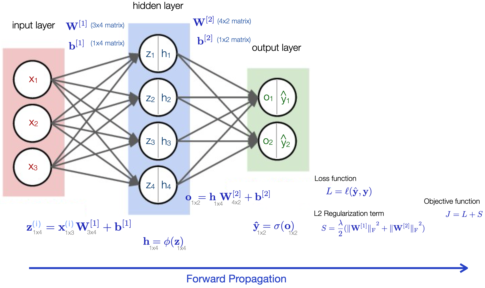

# [4.7 Forward Propagation, Backward Propagation, and Computational Graphs](https://d2l.ai/chapter_multilayer-perceptrons/backprop.html)

- Computation loop when training a neural network:
  - **Forward Propagation** : compute the outputs (logits) of the model
  - Calculate the **loss function** between the true label and model prediction.
  - **Backward Propagaton** : compute derivatives of the loss with respect to model parameters.
  - Update netwrok parameters with mini-batch gradient descent.

- Open source machine learning packages (PyTorch, TensorFlow, JAX, MXNet...) provide **automatic differentiation** algorithm to compute derivatives that are needed for gradient descent. 
 

## 1. Forward Propagation

 &emsp;  * Note: The textbook uses two different notations to express the dimension of the weight matrix **W**. In §3.4 and §4.1, **W**'s dimension is expressed as (input neurons x output neurons), whereas in §4.7 **W**'s dimension is expressed as (output neurons x input neurons). Throughout this brief summary note, I choose to keep the dimension of **W** as (input neurons x output neurons). The equations here and below are therefore sometimes appeared different compared with the textbook to keep the dimensions of matrix multiplications correct subjected to the chice of my convention.

 ## 2. Backward Propagation

- Backpropagation is a method to compute the final objective function with respect to network parameters **W** and **b**. It traverses the network's computational graph in reverse order and derives derivatives with **chain rule**.
  

 

 - In the forward propagation pass, we traverse the computational graph in the direction of dependencies and compute all the variables on its path. To avoid duplicate calculations, the intermediate values from the forward pass are stored in memory for later gradient computations with backpropagation. 

-  The size of the intermediate values is roughly proportional to the number of network layers and the batch size.

- Auto-differentiation is not numerical differentiation.  
  Numerical differentiation can easily introduce round-off errors.  
  (See [Wikipedia](https://en.wikipedia.org/wiki/Automatic_differentiation) for the distinction among **auto-differentiation**, **numerical differentiation**, and **symbolic differentiation**.)

- PyTorch has a list of basic functions and the expression of their derivatives. When designing our own network, most of the time, we only need to focus on the calculations involved in forward propagation. We only need to write a backwork definition when using a custom function or third party library (Reference: [When to implement backward()?](https://discuss.pytorch.org/t/when-to-implement-backward/98067)). 