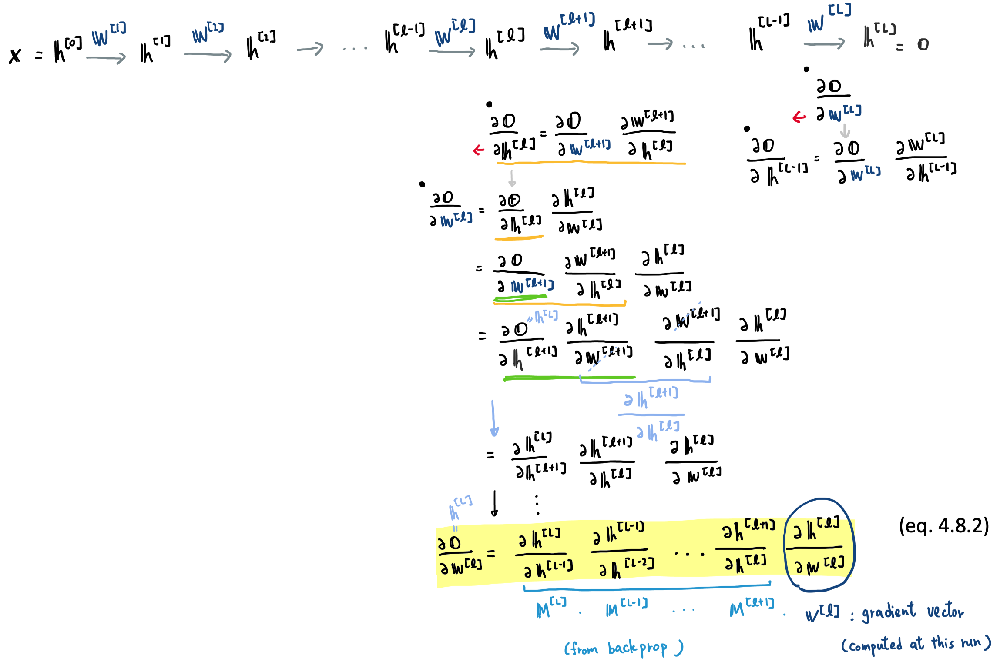
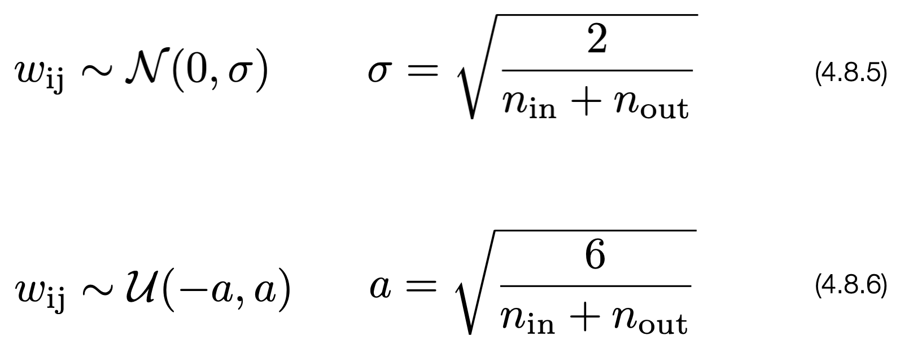

# [4.8 Numerical Stability and Initialization](https://d2l.ai/chapter_multilayer-perceptrons/numerical-stability-and-init.html)

- The choice of initialization scheme plays a significant role in neural network learning, and it can be crucial for maintaining numerical stability. Moreover, these choices can be tied up in interesting ways with the choice of the nonlinear activation function.

- How we initialize parameters can determine how quickly our optimization algorithm converges. Poor choices here can cause us to encounter exploding or vanishing gradients while training.

## 1. Vanishing and Exploding Gradients



- The gradient of **o** w.r.t. **W**^[ℓ] is the product of a series matrices **M**^[L], ..., **M**^[ℓ+1] and the gradient vector **v**^{[ℓ]}. 
- If all the **M** matrices, after diagonalized, are just a little bit bigger than or smaller than the identity matrix (**I**), then with a very deep network, their product might just explode (the **exploding gradient** problem) or decrease exponentially (the **vanishing gradient** problem).


#### Vanishing Gradients due to choices of activation functions

- The gradients of **Sigmoid** or **Tanh** activation functions approach to **0** when the input is very large or very small.

- This is why **ReLU** is the most popular choice of activation function for the hidden layers in Neural Nets. 

- To stabilize the training process, when there are **Sigmoid** or **Tanh** activation functions in a network, we prefer to initialize the network weights to very small random values to avoid the values of hidden neurons falling to 'flattern zones' of **Sigmoid** or **Tanh** too soon.


## Parameter Initialization

#### Can we initialize all the network weight parameters to be zero ?

- No! This will bring us the **dead neuron problem**. The gradients for hidden layer **h**^[ℓ] are computed by multiplying the gradients obtained by backprop from layer ℓ+1 with the existing weights in this layer **W**^[ℓ] (see [this slide](./images/slide_backprop.png) for detail). If the initial weights in **W**^[ℓ] are all zeros, the gradients of hidden layer **h**^[ℓ] will also be zero. 

- Run the following code to test: 

```py
import torch
from torch import nn
import torch.optim as optim

# --- define network structure --- 
net = nn.Sequential(nn.Linear(1, 2, bias=False), 
                    nn.Tanh(), 
                    nn.Linear(2, 1, bias=False))

learning_rate = 0.1
optimizer = torch.optim.SGD(net.parameters(), lr=learning_rate)

# --- init network weights to be 0. --- 
nn.init.constant_(net[0].weight, 0.)
nn.init.constant_(net[2].weight, 0.)

print('--- layer 1 weights and biases')
print(net[0].weight)

print('--- layer 2 weights and biases')
print(net[2].weight)

# --- training loop --- 
Niters = 100
for j in range(Niters):
    x = torch.rand(1)
    out = net(x)
    
    optimizer.zero_grad() 
    out.backward() 
    optimizer.step()

# --- check network weights again --- 
print('--- layer 1 weights and biases')
print(net[0].weight)

print('--- layer 2 weights and biases')
print(net[2].weight)
```

#### Can we initialize all the network weight parameters to be constant ?

- No. If initializing all the weights to be the same value, then all hidden units are basically computing the same thing, passing the same values to the next layer. No matter how many iterations of training, all the hidden units in the same layer are still in symmetry representing the same feature. -> There's no benefit of having more than one hidden unit in each layer. 

- Run the following code to test: 

```python
import torch
from torch import nn
import torch.optim as optim

# --- define network structure --- 
net = nn.Sequential(nn.Linear(1, 2, bias=False), 
                    nn.Tanh(), 
                    nn.Linear(2, 1, bias=False))

learning_rate = 0.1
optimizer = torch.optim.SGD(net.parameters(), lr=learning_rate)

# --- init network weights to be 0. --- 
nn.init.constant_(net[0].weight, 0.3)
nn.init.constant_(net[2].weight, 0.5)

print('--- layer 1 weights and biases')
print(net[0].weight)

print('--- layer 2 weights and biases')
print(net[2].weight)

# --- training loop --- 
Niters = 100
for j in range(Niters):
    x = torch.rand(1)
    out = net(x)
    
    optimizer.zero_grad() 
    out.backward() 
    optimizer.step()

# --- check network weights again --- 
print('--- layer 1 weights and biases')
print(net[0].weight)

print('--- layer 2 weights and biases')
print(net[2].weight)
```


#### **Random initialization** is key to ensure that symmetry is broken before optimization.

- The default parameter values in `nn.Linear` in PyTorch is initialized with a uniform distribution from `(-std, std)`, with `std = 1 / sqrt(N_neurons)`. 

### Xavier Initialization

- Initialize weights of each layer **randomly** from a **Gaussian** distribution or **Uniform** distribution with **mean 0**.

- The variance of weights for each layer, **Var[** w_ij^[ℓ] **]**, is scaled to be proportional to `1/(n_out + n_in)` (i.e. **inverse** of **number of input neurons** + **number of output neurons**). 

&emsp;  &emsp;  &emsp;&emsp;   

- This way, we can end up with a nice property that the **variance of logits**, **Var[** z_i^[ℓ] **]**, computed for each layer are more or less being the same throughout the entire network. <br>
**Var[** x_i **]** = **Var[** z_i^[1] **]** = **Var[** z_i^[2] **]** ... = = **Var[** o_i **]** 

