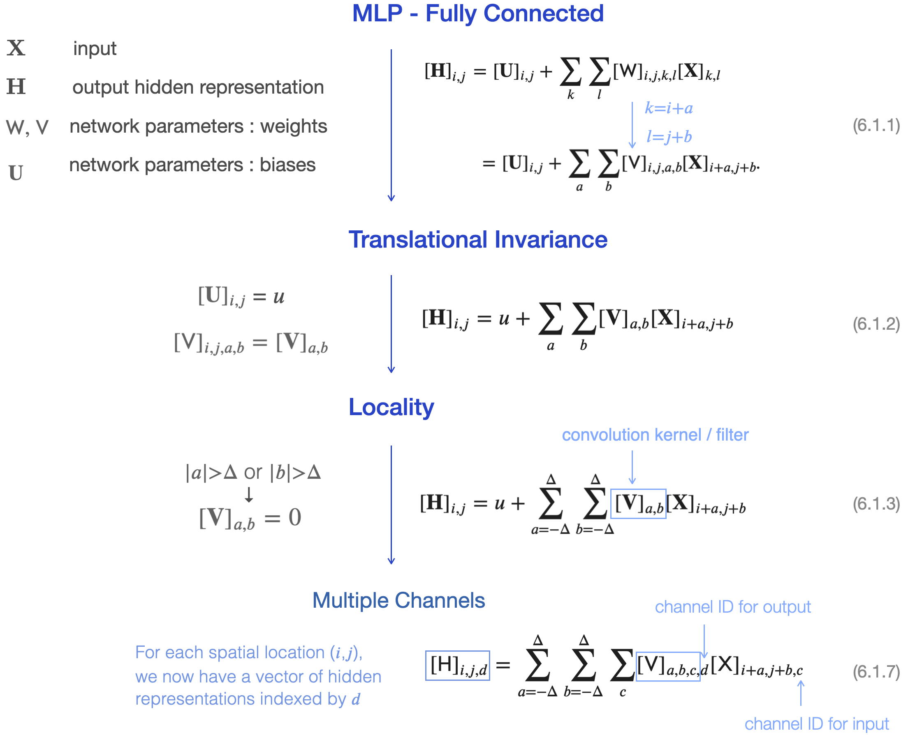

# [6.1. From Fully-Connected Layers to Convolutions](https://d2l.ai/chapter_convolutional-neural-networks/why-conv.html)

### Multilayer Perceptrons (MLP)

- No prior assumption on network structure. (i.e. Do not put any constraint on how features may interact.)
- Good for **tabular data**.
- Previously when applying MLP on image data, we simply flattening an image's spatial structure into a long 1D vector, and feeding it through the MLP network. -> A lot of network parameters. -> Need enormous amount of data to train -> Low data efficiency. 

### Convolutional Neural Network (CNN)

- A powerful family of neural networks that are efficient for **natural signals**. 
- In image processing, CNNs typically require many fewer parameters than MLPs.
- The price paid for this drastic reduction in parameters is that our features are now **translation invariant** and that our layer can only incorporate **local information**, when determining the value of each hidden activation.

### Properties of Natural Signals

- **Translational Invariance** <-> **Parameters (weights) sharing**  
    - Similar patterns repeat throughout a signal / in different regions of an image.
    - Convolution kernel: use a small set of parameters multiple times across the network structure.

- **Locality** <-> **Sparsity**  
  - Nearby pixels/points are more correlated with each other than pixels/points far away.  
  e.g. X[0,0] is blue → high probability that the next pixel is also blue.
  - Connection sparsity : Drop connections between far away neurons. 

- **Compositionality** <-> **Stacking of Layers**
    - Everything in nature is composed of parts that are composed of sub-parts.
    - Earlier layers learn more basic patterns. Later layters learn more complex structures composed from simpler patterns. 

&emsp;  * Reference : [Properties of natural signals -- Alfredo Canziani](https://atcold.github.io/pytorch-Deep-Learning/en/week03/03-3/).

### Inductive Bias / Learning Bias

- In machine learning, inductive bias refers to a set of (explicit or implicit) assumptions made by a learning algorithm to learn the target function and to generalize beyond training data.
- If those biases do not agree with reality, e.g., if images turned out not to be translation invariant, our models might struggle even to fit our training data.

&emsp;  * Reference : [Inductive Bias](https://link.springer.com/referenceworkentry/10.1007/978-1-4419-9863-7_927).

## Constraining the MLP with assumptions on natural signal properties

- Channels on input and output allow our model to capture multiple aspects of an image at each spatial location.